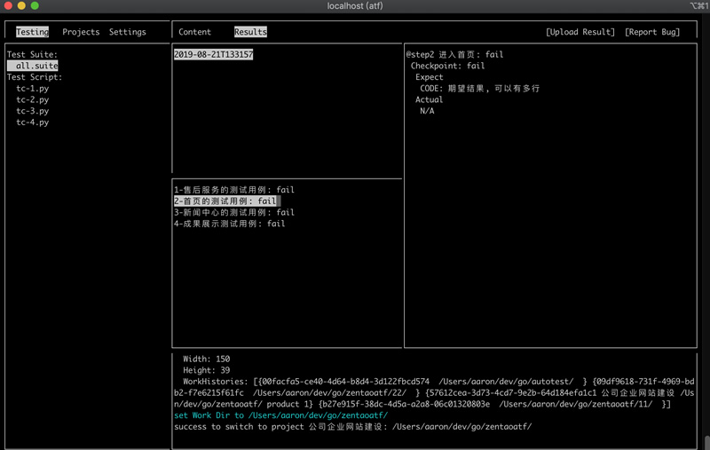
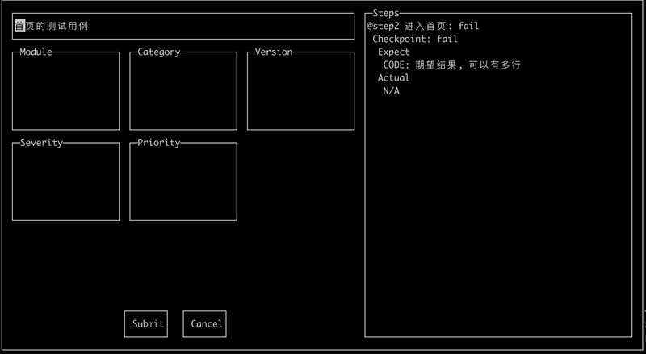

# zentaoatf
ZentaoATF is an automation testing framework written in Golang.

## Features
1. Support most popular programming languages like Python, Ruby, Lua, Tcl, PHP, Shell, GO and Windows Bat;
2. Reduce the invasive of existing testing scripts
3. Integration with ZenTao - an open source project management system;
3. Easy to use with the help of UI window

## QuickStart
### Run from release file
1. Download last release file from [here](https://github.com/easysoft/zentaoatf/releases);
2. Type 'atf-2.0.0.alpha.exe' to get the help doc.

### Run from Golang codes
1. Use 'git clone https://github.com/easysoft/zentaoatf.git' to get the source codes;
2. Type `go get -u all' to get all dependencies;
3. Type 'go run src/atf.go' to get the help doc;

## Usage:
You need a Zentao user account with super model API permissions, below we use autotest01/P2ssw0rd on http://ruiyinxin.test.zentao.net site 
#### Import test cases from remote Zentao system
```go run src/atf.go gen -u http://ruiyinxin.test.zentao.net -t product -v 1 -l python -a autotest01 -p P2ssw0rd```

#### Run demo test scripts
For Windows

```go run src/atf.go run -f scripts-demo/tc-01.bat -l bat```

For Linux/Mac

```go run src/atf.go run -f scripts-demo/tc-01.sh -l shell```

#### Run test scripts in specified folder
```go run src/atf.go run -d scripts -l python```

#### Batch run with test suite
```go run src/atf.go run -f scripts/all.suite -l python```

#### Rerun failed test cases in specified result file
```go run src/atf.go rerun -p logs/suite-all-2019-08-21T133157/result.txt```

#### List test scripts
```go run src/atf.go list -d scripts -l python```

#### Brief test scripts in dir
```go run src/atf.go view -d scripts -l python```

#### View test scripts by path
```go run src/atf.go view -f scripts/tc-1.py -f scripts/tc-2.py```

#### Switch work dir to another path
```go run src/atf.go switch -p /Users/aaron/dev/go/autotest/```

#### Change tool language（en: English, zh: Simplified Chinese）
```go run src/atf.go set -l zh```

#### Open CUI Window
```go run src/atf.go cui```

#### Submit test result to remote Zentao system


#### Report bug for failed test case to remote Zentao system


### Test Suite
```scripts/tc-1.py
scripts/tc-2.py
scripts/tc-3.py
scripts/tc-4.py
```

### Test Script
```#!/usr/bin/env python3
'''
<<TC
caseId:         1
caseIdInTask:   0
taskId:         0
title:          售后服务的测试用例
steps:          @开头的为含验证点的步骤
   @step1           进入首页
expects:
# @step1 
CODE: 期望结果, 可以有多行

readme:
- 脚本输出日志，同expects章节中#号标注的验证点需保持一致对应
- 脚本中CODE打头的注释需用代码替换
- 参考样例https://github.com/easysoft/zentaoatf/tree/master/xdoc/sample

TC
'''

#CODE: 此处编写操作步骤代码

print("#")  # @step1: 正常显示
#CODE: 输出验证点实际结果
```

## Licenses
All source code is licensed under the [Z PUBLIC LICENSE](LICENSE.md).